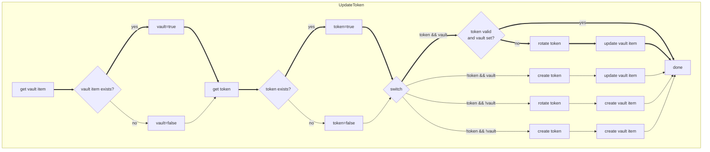

# GitLab Token Operator

## Purpose

Token Operator regularly rotates your GitLab tokens and updates them in your **1Password** or **HashiCorp** vault,
in order to reduce token rotation maintenance, increase security and avoid tokens with long validity in case they get leaked.

With this, the configuration files can also serve as an "inventory" of tokens, for example for regular reviews and audits.
Fine-grained access control and auditing features of your vault instance allow you to provide safe access to your GitLab tokens.

See our documentation site [https://toop.sickit.eu](https://toop.sickit.eu) for more detailed documentation.

## Get `tocli` (token-operator cli)

### Download the binary for your platform

For releases and binaries, see https://gitlab.com/sickit/token-operator/-/releases

```shell
OS=linux
ARCH=amd64
VERSION=0.3.2
curl -Lo tocli https://gitlab.com/sickit/token-operator/-/releases/v${VERSION}/downloads/tocli_${VERSION}_${OS}_${ARCH}
chmod +x tocli
./tocli --help
```

### Run it with docker

```shell
docker run --rm -it registry.gitlab.com/sickit/token-operator:0.3.2 --help
```

## Use helper script to dump all tokens

We provide a little shell script to dump existing tokens in the format you need them.
Only an admin PAT can list tokens of users.

```shell
export GITLAB_HOST=https://gitlab.com
export GITLAB_TOKEN=...
./scripts/dump-tokens.sh 2> /dev/null | tee alltokens.yaml
```

## TL;DR: Rotate personal access tokens

Prerequisites

- Create a personal access token in GitLab with scopes `api` for the token-operator
- [Create a 1Password service account](https://developer.1password.com/docs/service-accounts/get-started/) with read/write access to the vault where you want to store your GitLab tokens.

The PAT you want to rotate must already exist, so create a personal access token in GitLab which you want to rotate
(you don't need to save the token itself). Of course, you can also "self-rotate" the token you use for token-operator.

Then create a configuration for your personal access tokens (`personal-tokens.yaml`, also supports JSON)

```yaml
default_rotation:
  rotate_before: 168h # one week
  validity: 888h # five weeks
tokens:
  - name: mytoken
    state: active # or inactive, deleted
    source:
      name: my-token
      description: "describe what you use it for or where you use it"
      type: personal
      scopes: ["read_api"] # see https://docs.gitlab.com/user/profile/personal_access_tokens/#personal-access-token-scopes
    vault:
      path: my-token-vault
      item: my-gitlab-token
      field: password
```

Run token-operator with the GitLab PAT you created for the token-operator and the 1Password service account token

```shell
tocli --source.token glpat-.... --vault.token ops-ey... \
    --config personal-tokens.yaml --log.format console [--dry-run]
```

On the initial run, token-operator notices that the vault item does not exist yet, so it will
rotate the PAT to get its value and then create the vault item for it.

## TL;DR: Rotate group and project access tokens (Enterprise version)

Prerequisites

- Create a personal access token in GitLab with scopes `api` for the token-operator.
  The person creating the PAT must have permissions to edit access tokens in the group or project.
- [Create a 1Password service account](https://developer.1password.com/docs/service-accounts/get-started/) with read/write access to the vault where you want to store your GitLab tokens.

Create a configuration for your group/project access tokens (`group-tokens.yaml`, also supports JSON)

```yaml
default_rotation:
  rotate_before: 168h # one week
  validity: 888h # five weeks
tokens:
  - name: grouptoken
    state: active
    source:
      name: my-group-token
      description: "describe what you use it for or where you use it"
      type: group
      owner: mygroup
      role: reporter
      scopes: ["read_api"]
    vault:
      path: group-token-vault
      item: group-gitlab-token
      field: password
```

Run token-operator with the GitLab PAT you created for the token-operator and the 1Password service account token

```shell
tocli --source.token glpat-.... --vault.token ops-ey... \
    --config personal-tokens.yaml --log.format console [--dry-run]
```

On the initial run, token-operator notices that the group access token does not exist and create it.
If the vault item already exists, it will update its value, otherwise it will create the vault item.

To rotate the PAT used for token-operator, simply create either a separate configuration or
add the PAT to the end of `tokens`, so that it is rotated last.

## TL;DR: Install token-operator CLI cronjob with Helm chart

Add, update and list versions in `token-operator` repository:
```console
helm repo add toop https://gitlab.com/api/v4/projects/sickit%2Ftoken-operator/packages/helm/stable
helm repo update
helm search repo toop
```

After creating your own `values.yaml` with your configuration for token-operator, install the cronjob `tocli-cron`:
```console
helm show values toop/tocli-cron > values.yaml
# edit `values.yaml` to your needs, specifically to add your token-operator config and the source and vault token.
helm install tocli-cron toop/tocli-cron --namespace tocli --create-namespace --values values.yaml
```

Uninstall it with the following commands:
```console
helm uninstall tocli-cron --namespace tocli
```

## Get the enterprise version

The enterprise version supports `group` and `project` GitLab tokens as well as `hashicorp` vault.
Additional features may be requested as well. 

Contact us at: toop@sickit.eu

If you're interested in using Token Operator with [Bitwarden](https://bitwarden.com/) or [Keeper](https://www.keepersecurity.com/), 
please drop us an email.

## How it works

This shows the application flow, checking the vault item first, so that it fails early if we don't have access to the vault.
The main flow is left, once the token and vault item exist.



## License

[GPL-3](./LICENSE)


